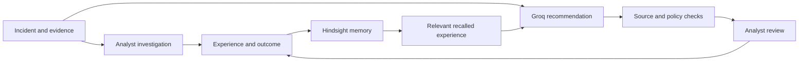

# GhostSOC / Continuity

**A security operations platform that learns from every investigation.**

Continuity brings incident evidence, analyst decisions, and retained experience into one workflow. [Hindsight](https://hindsight.vectorize.io/) stores and recalls investigation experience; [Groq](https://groq.com/) reasons over the current case and verified prior incidents. Recommendations remain advisory, and analysts stay in control of response.

> **Demo scope:** NovaBank incidents and controlled web events are synthetic. Response actions run in dry-run mode; the demo does not attack systems or execute containment.

## How it works



Continuity verifies recalled document IDs against its retained incident records before using them as historical evidence in recommendations. Security Memory search can also display Hindsight facts that have no linked incident record, clearly labeled as unlinked. If a provider is unavailable, the app reports that state instead of presenting it as an empty search or a simulated answer.

## Capabilities

- Ingest and normalize endpoint, network, and allowlisted web events.
- Detect and correlate activity into incidents with evidence, timelines, risk context, and MITRE ATT&CK mappings.
- Explore live activity, alerts, attack patterns, incident relationships, and operational trends.
- Retain investigation paths, failed approaches, side effects, outcomes, analyst feedback, and lessons in Hindsight.
- Use Groq to produce structured, source-checked investigation recommendations.
- Enforce response policy, approval, audit, and dry-run controls.
- Connect to optional external security tools through configured connectors.

## Quick start

### Windows

Requirements: Docker Desktop with Compose v2, and at least 4 GB of available memory.

```powershell
git clone https://github.com/Dhrona1421/Threat-X.git
Set-Location Threat-X
Set-ExecutionPolicy -Scope Process Bypass
.\install.ps1
```

The installer creates a private `.env` with generated local credentials if one does not exist, builds the services, waits for health checks, and prints the local login details. Save the generated password. Open [http://localhost:8080](http://localhost:8080).

### macOS or Linux

With Docker Engine and Compose v2 installed:

```bash
git clone https://github.com/Dhrona1421/Threat-X.git
cd Threat-X
chmod +x install.sh
./install.sh
```

### Optional live AI and memory providers

The core application and deterministic demo can run without external provider keys. To enable live recommendations and organizational memory, add credentials to the private `.env` file:

```dotenv
GHOSTSOC_LLM_BASE_URL=https://api.groq.com/openai/v1
GHOSTSOC_LLM_API_KEY=<your Groq API key>
GHOSTSOC_LLM_MODEL=openai/gpt-oss-120b
GHOSTSOC_HINDSIGHT_URL=<your Hindsight API endpoint>
GHOSTSOC_HINDSIGHT_API_KEY=<your Hindsight API key>
GHOSTSOC_HINDSIGHT_BANK_ID=ghostsoc-security
```

Never commit `.env` or paste provider credentials into issues, screenshots, or chat. After changing provider settings, recreate the backend from the repository directory:

```powershell
docker compose up -d --force-recreate backend
```

## Try the synthetic walkthrough

Run these commands from the repository directory:

```bash
docker compose --profile demo run --rm demo-runner
docker compose --profile demo run --rm web-demo-runner
docker compose ps
```

The web walkthrough replays inert access-log records against the local demo service and records only a dry-run response. It does not run exploits, malware, PowerShell, Atomic Red Team, or real containment actions.

## Technology

| Area | Technology |
|---|---|
| API and services | Python, FastAPI, SQLAlchemy |
| User interface | React, Vite |
| Application data | PostgreSQL |
| Search | OpenSearch |
| Incident memory | Hindsight |
| Recommendations | Groq API |
| Local deployment | Docker Compose |

## Configuration and security

- `DRY_RUN` is enabled by default; simulated responses are not represented as confirmed containment.
- Web events are accepted only for explicitly allowlisted hosts.
- Response actions use typed targets and policy checks; approval and audit remain part of the workflow.
- Provider keys are read by the backend from environment variables and are not sent to the browser.
- Optional integrations require their own authorized deployments and credentials. They are not bundled services.
- The self-contained detection pipeline supports a documented Sigma-compatible subset; it is not a complete Sigma or MITRE ATT&CK implementation.

See the [security notes](docs/SECURITY.md), [response policy](docs/RESPONSE_POLICY.md), [connector guide](docs/CONNECTORS.md), and [web security guide](docs/WEB_SECURITY.md).

## Development and verification

For local development, use Python 3.11–3.13 and Node.js 20.19 or newer. The Makefile provides common setup and check commands on systems with `make`:

```bash
make install
make verify
```

`make verify` runs backend tests and linting, migration checks, frontend audit/lint/build, and a tracked-file secret-pattern scan. Docker Compose builds and live-provider checks require Docker and valid provider configuration.

Helpful references: [architecture](docs/ARCHITECTURE.md), [API](docs/API.md), [memory setup](docs/MEMORY_LAYER.md), [NovaBank walkthrough](docs/DEMO.md), [testing](docs/TESTING.md), and [troubleshooting](docs/TROUBLESHOOTING.md).

## Project status and limitations

The local Compose stack and controlled synthetic walkthrough have been exercised, and the backend test suite and Ruff checks pass. Live-provider results are integration checks on synthetic cases, not a production accuracy or effectiveness benchmark. External Wazuh, Velociraptor, Arkime, MISP, OpenCTI, Shuffle, and CTI services require separate authorized deployments and configuration. Production use also requires environment-specific security review, TLS, monitoring, and operational hardening.

## Troubleshooting

Run `docker compose` from the repository directory containing `docker-compose.yml`. If your prompt is in another directory (for example, `C:\Windows\System32`), Compose may report `no configuration file provided`; first run `Set-Location` to the cloned `Threat-X` directory, then retry.

For service status and logs:

```bash
docker compose ps
docker compose logs -f backend frontend
```
