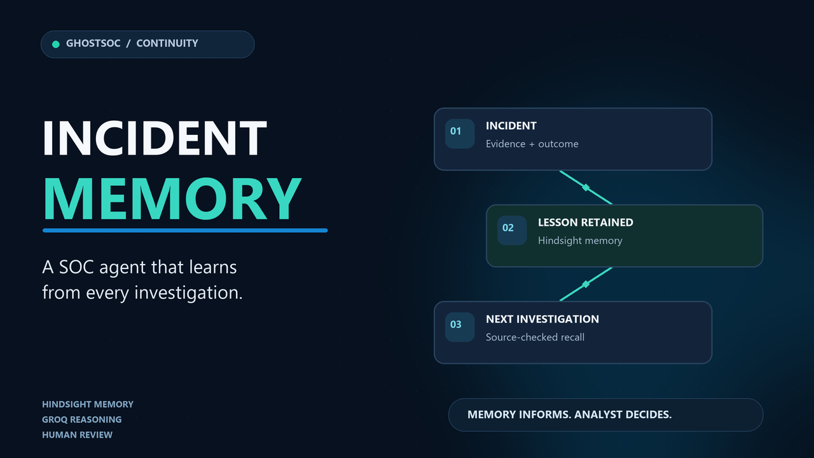

<div align="center">

# Continuity

### Security operations that learn from every investigation

**GhostSOC · Hindsight memory · Groq reasoning · Analyst-led response**

[](https://www.python.org/)
[](https://docs.docker.com/compose/)
[](https://hindsight.vectorize.io/)
[](https://groq.com/)
[](LICENSE)

[Live demo](#live-demo) · [Video walkthrough](#video-walkthrough) · [Quick start](#quick-start) · [How it works](#how-it-works) · [Documentation](#documentation) · [Contributing](CONTRIBUTING.md) · [Security](SECURITY.md)



</div>

Continuity helps security teams carry investigation experience into the next incident. It combines current evidence with source-checked lessons retained in Hindsight, then asks Groq to recommend investigative steps. **The recommendation is advisory; the analyst remains in control.**

> **Demo data is synthetic.** NovaBank cases and controlled web events are exercises. The demo does not attack systems or execute real containment actions.

## Live demo

Explore the live [Continuity demo](http://20.187.115.54/).

**Demo credentials:**

- **Email:** `admin@ghostsoc.local`
- **Password:** `Admin@Password`

The instance is provided for demonstration purposes using synthetic data.

## Video walkthrough

Watch the [Continuity walkthrough on YouTube](https://www.youtube.com/watch?v=YKAyLRCVDXI), or [download the MP4](Final-YT.mp4).

## At a glance

| Investigate | Learn | Reuse carefully |
|---|---|---|
| Ingest security events, correlate alerts, and review incident evidence. | Retain what analysts tried, what worked or failed, outcomes, and feedback in Hindsight. | Recall relevant experience, verify its source, and give Groq the current case plus eligible history. |

## How it works

**Incident and evidence → Analyst investigation → Hindsight memory → Source-checked recall → Groq recommendation → Analyst review → New lesson.**

Continuity checks recalled document IDs against retained incident records before using memories as historical evidence in a recommendation. Security Memory search can also show Hindsight facts with no linked incident, clearly labeled as unlinked. If a provider is unavailable, Continuity reports that state instead of presenting it as an empty search or a simulated answer.

## What you can do

- **Monitor activity:** ingest normalized endpoint, network, and allowlisted web events; view alerts, incidents, timelines, and live activity.
- **Investigate:** review evidence, risk context, incident relationships, operational trends, and MITRE ATT&CK mappings.
- **Carry lessons forward:** retain failed paths, side effects, outcomes, analyst feedback, and lessons in Hindsight.
- **Get a sourced recommendation:** have Groq reason over the current incident and verified historical experience.
- **Keep response controlled:** enforce policy, approval, and audit checks; dry-run is the default.
- **Connect existing tools:** configure optional security and threat-intelligence services for your environment.

## Quick start

### Windows

Install [Docker Desktop](https://www.docker.com/products/docker-desktop/) with Compose v2, then run in PowerShell:

```powershell
git clone https://github.com/Dhrona1421/Continuity.git
Set-Location Continuity
Set-ExecutionPolicy -Scope Process Bypass
.\install.ps1
```

### macOS or Linux

Install Docker Engine with Compose v2, then run:

```bash
git clone https://github.com/Dhrona1421/Continuity.git
cd Continuity
chmod +x install.sh
./install.sh
```

The installer creates a private `.env` with generated credentials if one does not already exist, builds the services, and waits for health checks. It prints the generated password on first setup; if you already have an `.env`, use the credentials configured there. Save the password, then open [http://localhost:8080](http://localhost:8080).

### Enable live Hindsight and Groq

The local core and synthetic walkthrough can run without provider credentials. To enable live memory and recommendations, add the following settings to the private `.env` file:

```dotenv
GHOSTSOC_LLM_BASE_URL=https://api.groq.com/openai/v1
GHOSTSOC_LLM_API_KEY=<your Groq API key>
GHOSTSOC_LLM_MODEL=openai/gpt-oss-120b
GHOSTSOC_HINDSIGHT_URL=<your Hindsight API endpoint>
GHOSTSOC_HINDSIGHT_API_KEY=<your Hindsight API key>
GHOSTSOC_HINDSIGHT_BANK_ID=ghostsoc-security
```

Never commit `.env` or share provider credentials in issues, screenshots, or chat. After changing provider settings, run this from the repository directory:

```powershell
docker compose up -d --force-recreate backend
```

## Try the synthetic walkthrough

Run the commands from the directory containing `docker-compose.yml`:

```bash
docker compose --profile demo run --rm demo-runner
docker compose --profile demo run --rm web-demo-runner
docker compose ps
```

These demos use deterministic fixtures and inert web access-log records. They do not run exploits, malware, PowerShell, Atomic Red Team, or real containment actions. Simulated results are labeled and remain `DRY_RUN`.

## Documentation

| Need | Guide |
|---|---|
| Install and configure | [Installation](INSTALL.md) · [Troubleshooting](docs/TROUBLESHOOTING.md) |
| Understand the system | [Architecture](docs/ARCHITECTURE.md) · [Feature matrix](docs/FEATURE_MATRIX.md) |
| Configure incident memory | [Hindsight memory setup](docs/MEMORY_LAYER.md) · [Agent design](docs/AI_AGENT.md) |
| Use the API and demo | [API reference](docs/API.md) · [NovaBank walkthrough](docs/DEMO.md) |
| Review safeguards | [Security model](docs/SECURITY.md) · [Response policy](docs/RESPONSE_POLICY.md) · [Web security](docs/WEB_SECURITY.md) |
| Run checks | [Testing guide](docs/TESTING.md) · [Release status](docs/RELEASE_STATUS.md) |

## Development

For local development, use Python 3.11–3.13 and Node.js 20 or newer. With `make` installed:

```bash
make install
make verify
```

The verification command runs backend tests and linting, migration checks, frontend audit/lint/build, and a tracked-file secret-pattern scan. See [Contributing](CONTRIBUTING.md) for focused commands and pull-request guidance.

## Security and scope

- Dry-run is enabled by default. Simulated results are never reported as confirmed containment.
- Web events are accepted only for explicitly allowlisted hosts.
- Response actions use typed targets, policy checks, approval, and audit records.
- Provider credentials are read by the backend from environment variables; they are not returned to the browser.
- Optional integrations require separately deployed services and authorized credentials.
- The bundled Sigma-compatible detection engine supports a documented subset; MITRE ATT&CK mappings are curated rather than exhaustive.
- This project has been exercised with synthetic cases. Live-provider results are integration checks, not production accuracy or effectiveness benchmarks.

If you discover a security issue, follow [the private reporting guidance](SECURITY.md). Please do not post credentials or exploit details in a public issue.

## Community

Contributions, bug reports, and documentation improvements are welcome. Start with [CONTRIBUTING.md](CONTRIBUTING.md) and follow the [Code of Conduct](CODE_OF_CONDUCT.md).

## License

Continuity is available under the [MIT License](LICENSE). Third-party dependencies and services remain subject to their own licenses and terms.

<div align="center">

**Remember the experience. Verify the source. Let the analyst decide.**

</div>
