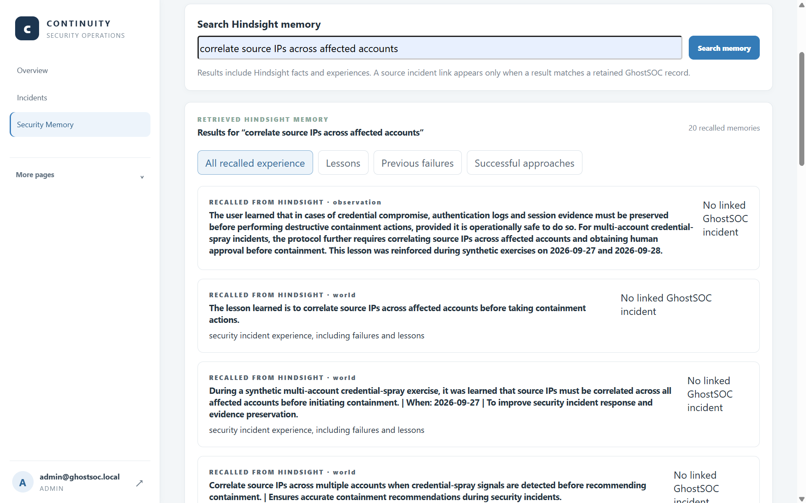
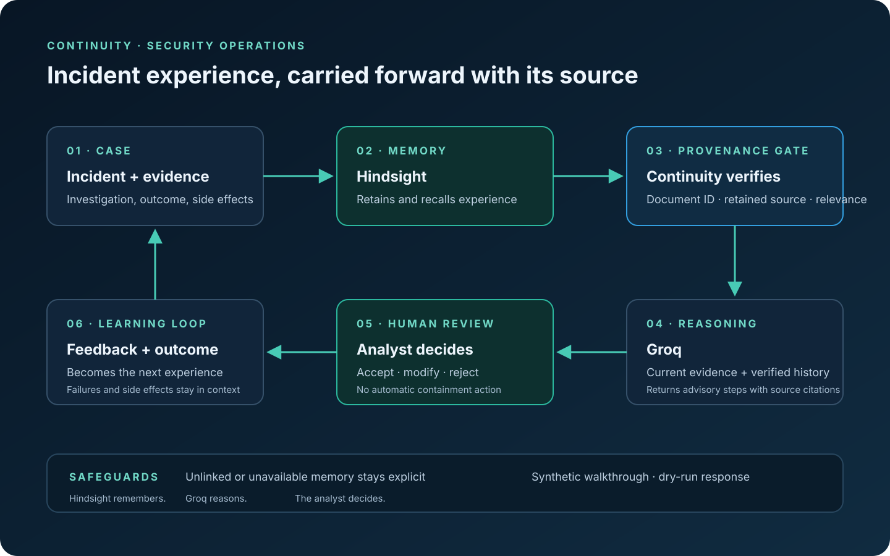
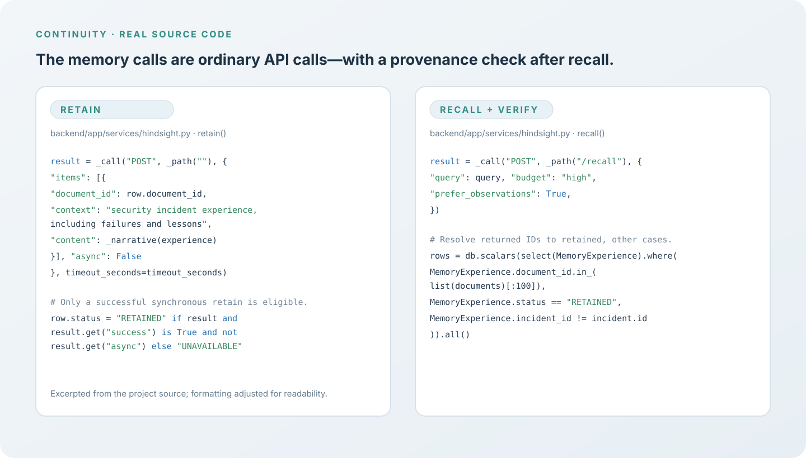

# We Put Failed Paths in Hindsight Memory

A security postmortem can document what finally worked and still omit the detail the next analyst most needs: what failed, what it cost, and why the team stopped doing it.

We built Continuity to carry that experience into future investigations. The product lives in the GhostSOC repository, but we present it publicly as Continuity: a security operations workflow that retains analyst-reviewed experience, recalls it when relevant, and keeps recommendations under human control.



*This result is useful to inspect, while its unlinked status keeps it separate from source-backed case history.*



*The memory loop carries lessons forward without turning them into automatic response rules.*

## Why a “successful fix” is not enough

Incident reports often summarize the timeline and resolution. That is useful, but incomplete. During an investigation, analysts form hypotheses, gather evidence, try response paths, reject suggestions, and discover side effects. If the final record only says “account secured,” the next responder may repeat a step that destroyed session evidence or missed another affected account.

We want the memory to preserve context, not turn one case into a universal playbook. In Continuity, an experience can include hypotheses, useful evidence, successful and failed investigative paths, response outcomes, side effects, analyst decisions, and lessons with conditions. A remembered lesson should say when it applies and what tradeoff it is meant to avoid.

This is where [Hindsight](https://github.com/vectorize-io/hindsight) fits. We retain an investigation narrative and ask Hindsight to recall relevant facts for a later incident. Hindsight’s [documentation](https://hindsight.vectorize.io/) explains its retain-and-recall workflow; Vectorize’s [agent memory overview](https://vectorize.io/what-is-agent-memory) describes why persistent memory can carry context between otherwise separate interactions.

## A failure becomes useful only with context

Our synthetic NovaBank scenario gives this idea a concrete shape. In the exercise, the response path records a side effect: forensic session evidence was lost. The retained lesson is to preserve authentication evidence before destructive containment when it is operationally safe. This is fictional training data; no real account is disabled and no containment action is executed.

The distinction matters. “Preserve evidence” is not always the first step if active harm requires immediate interruption. The condition—when it is operationally safe—helps keep the lesson from becoming an unsafe blanket rule. The failure record adds the reason the lesson exists, so a later analyst can weigh it against the current incident.

Continuity’s experience snapshot carries failed outcomes as structured fields. When an existing experience is updated, the service preserves analyst-authored investigation notes, lessons, feedback, and side effects rather than replacing them with a fresh source snapshot:

```python
for field in ("investigation", "lessons", "analyst_feedback"):
    experience[field] = previous.get(field, experience[field])
experience["incident"]["outcome"] = previous.get("incident", {}).get("outcome")
experience["response"]["side_effects"] = previous.get("response", {}).get("side_effects", [])
```

That small merge is an important part of the learning loop. A new source update should not erase the analyst’s explanation of what went wrong. The experience remains connected to its incident and is retained in Hindsight under a stable document ID.



*The same source-linked path carries lessons forward without treating recall as authority.*

## Recall should change the investigation, not dictate it

When another case arrives, the application asks Hindsight for related experience. The result is not accepted just because its words look similar. Continuity matches returned document IDs to local records marked retained, excludes the current incident, and checks that the cases are related. Only eligible experiences can become historical context for a recommendation.

Before memory, the investigator works from the current case and may not know that a similar containment path previously lost useful evidence. After a relevant, source-linked memory is recalled, Groq can include that failure and its lesson when ordering suggested investigative steps. The analyst still evaluates whether the old context applies now. The system records acceptance, modification, or rejection as feedback; it does not treat retrieval as authority.

This approach makes failure useful without making it deterministic. A previous side effect is evidence to consider, not proof that the same thing will happen again. The current case remains the primary source for current facts.

An old failure can also mislead if the environment has changed. Our recommendation instructions treat recalled text as untrusted data, never as a new instruction. Continuity checks the source and relevance; analysts still compare the lesson with current evidence and policy before using it.

This check also prevents a broad memory-bank search from becoming a shortcut around incident provenance. A fact may be relevant enough to show in search and still lack a linked source case. Continuity keeps that fact visible for exploration, but the recommendation path requires a retained source record before calling it prior incident experience.

The distinction is especially important for failure memory. A sentence such as “containment caused evidence loss” needs a case, an outcome, and a condition before it can inform another response. Without those details, the system could turn a partial recollection into a confident rule. Our implementation keeps the structured source experience beside the provider document ID so the analyst can inspect where that lesson came from.


*The code view follows the actual retain and recall path in the project source.*

## What this design does and does not show

The walkthrough uses fictional NovaBank incidents and synthetic web events. It demonstrates a memory workflow: record an exercise outcome, retain the experience, recall it in a related case, and compare the recommendation with and without history. The project has been exercised with live Hindsight and Groq in this synthetic flow, but that does not establish production retrieval quality, recommendation accuracy, or reduced response time.

That limitation is part of the story. We do not claim Continuity could have prevented Storm-0558, Midnight Blizzard, or any real incident. Those cases motivate the value of preserving investigative reasoning, but our demonstration is a controlled synthetic scenario. The response system defaults to dry-run, and recommendations are advisory.

We learned that useful memory is not just a collection of successful answers. Rejected paths, failed actions, and side effects can be the most valuable part—provided they retain their source and conditions. Hindsight remembers. Groq reasons over current evidence and eligible history. Analysts decide what applies. That is how a past mistake can help the next investigation without becoming an unquestioned rule.
