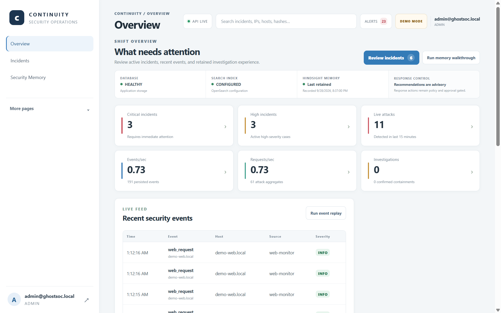
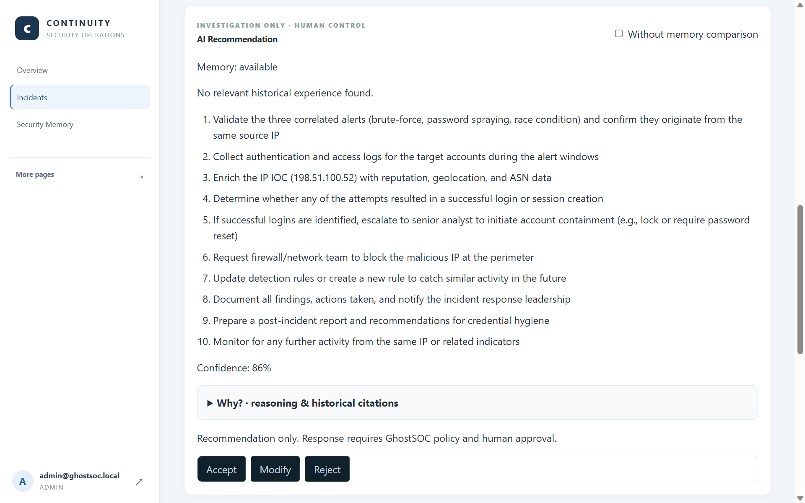

# We Kept Hindsight Recommendations in Human Hands

An AI recommendation can be useful and still be unsafe to execute automatically. In a security investigation, the cost of acting on the wrong context can include lost evidence, locked-out users, or a response that disrupts business operations.

We built Continuity around a simple boundary: the system can recall experience and recommend what to investigate, but the analyst decides what to do. Continuity is the public product name for the security operations system in the GhostSOC repository. Hindsight supplies persistent memory, Groq supplies language-model reasoning, and the analyst remains responsible for the response.



*The dashboard is the entry point; analysts move from current activity into investigation and memory.*



*Even when memory has no match, the interface exposes that fact and keeps a person in the decision loop.*

## Memory can inform a decision without making it

Continuity retains investigation experience: evidence that mattered, successful and failed paths, outcomes, side effects, lessons, and analyst feedback. When a new case arrives, it asks [Hindsight](https://github.com/vectorize-io/hindsight) to recall relevant facts. The [Hindsight documentation](https://hindsight.vectorize.io/) describes the retain-and-recall model, while Vectorize’s [agent memory overview](https://vectorize.io/what-is-agent-memory) explains the broader pattern of carrying information across interactions.

We add a provenance check before using recall in a recommendation. A returned Hindsight document ID must map to a retained source incident, differ from the current incident, and pass a relevance check. Unlinked memories can still appear in the general Security Memory search, but they are not presented to Groq as verified incident history.

Groq receives the current incident and any eligible historical experience. It produces investigative steps and reasoning. A source it cannot cite is not treated as evidence. If memory is empty, the instructions require the model to reason from current evidence alone:

```python
"If history is empty, cite nobody and reason only from current evidence. "
"Only recommend investigative or policy-reviewed actions; do not claim they were executed. "
```

The backend also validates the returned source IDs before showing historical evidence. The model can suggest that an analyst escalate a containment request through policy; it cannot claim that a block or account action has already happened.

## Accept, modify, reject—and keep the result

The recommendation interface makes the analyst’s role visible. An analyst can accept the suggested investigation path, modify it, or reject it. Feedback can include a reason, an outcome, or a corrected lesson. That information can then be retained as experience for a future case.

The “modify” and “reject” paths are not cosmetic. If a recommendation misses an affected account or puts a risky response step too early, the correction can explain what the analyst saw and why the order changed. If a recommendation is accepted and produces a useful result, that outcome can also be recorded. Memory improves through reviewed experience, not by assuming every generated answer was correct.

Our synthetic NovaBank scenario demonstrates the distinction. The first case begins without relevant history. The analyst records a lesson about preserving authentication evidence before destructive containment when operationally safe. In a related case, a source-linked experience can inform Groq’s suggested investigation order. The analyst reviews the context, decides whether it applies, and records the result. NovaBank is fictional; the browser replay is synthetic and performs no real containment.

Before memory, the recommendation uses only the current case. With an eligible memory, it can account for an earlier success, failure, or side effect. This is not a claim that the model becomes correct automatically. It is a workflow in which historical experience can be checked, cited, and challenged by the person responsible for the incident.

Trust also depends on making memory state visible. If Hindsight is unavailable, the system reports that it could not check. If the provider is available but finds no eligible case, the recommendation uses current evidence and cites no history. If a general search returns a fact without a matching source record, the interface labels it unlinked. Those states may look similar at a glance, but they mean different things to an investigator.

## Why we made the boundary explicit

Security tools often place a “recommend” button next to a “respond” button, which can make the transition feel small. Operationally, it is not small. A recommendation is information for a human decision; a response action changes a system. We keep these paths distinct.

The demo defaults to dry-run, uses typed targets and policy checks for response requests, and records audit history. Dry-run validates the request but makes no external change. Recommendations remain advisory, and approval requirements are enforced by the response workflow rather than inferred from model confidence.

The model does not call the response-action service. A separate request must pass target validation and policy checks; high-impact actions require the appropriate approval and are audited. Keeping those paths separate means that a persuasive sentence from Groq cannot silently become an instruction to a firewall or identity provider.


*The architecture separates memory retrieval, reasoning, review, and any policy-controlled response request.*

## Designing for uncertainty

We also had to decide what the application should say when the model or memory provider cannot help. “No relevant history” is a valid result. “Hindsight is unavailable” means the system could not check. “Unlinked” means a fact was returned but could not be tied to a retained incident. Those states should not collapse into one generic empty panel because each changes how much confidence the analyst should place in the recommendation.

The same discipline applies to model output. Groq can return an invalid citation, malformed response, or unsupported claim. The backend validates the result before presenting it as ready. If validation fails, Continuity reports that the recommendation is unavailable rather than presenting an unchecked answer as a successful one. This adds failure handling, but it gives the analyst a more truthful view of what the assistant actually used.

These safeguards do not remove the need for judgment. They make its inputs inspectable: which current evidence was present, whether history was available, which prior source was cited, and whether the model was allowed to recommend only an investigation step. An analyst can then challenge the recommendation with the same evidence that produced it.

This architecture has limits. It does not prove that historical memory improves every case, and our synthetic run is not a production efficacy benchmark. Retrieval can fail, no relevant experience may exist, and an old lesson can be wrong for new conditions. Continuity surfaces these states instead of pretending the model always has a useful memory.

The result is a narrower but more accountable assistant. Hindsight remembers. Groq reasons over current evidence and eligible history. Analysts accept, modify, or reject. Their decision can teach the next case, while the system leaves consequential action with the people and policies responsible for it.
